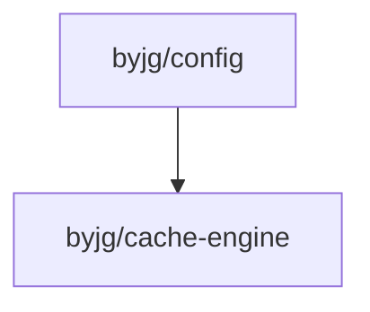

# Config: PSR-11 Container and Dependency Injection

[](https://github.com/byjg/php-config/actions/workflows/phpunit.yml)
[](http://opensource.byjg.com)
[](https://github.com/byjg/php-config/)
[](https://opensource.byjg.com/opensource/licensing.html)
[](https://github.com/byjg/php-config/releases/)
[](https://scrutinizer-ci.com/g/byjg/config/?branch=master)

This is a basic and minimalist implementation of PSR-11 for config management and dependency injection.

## Basics

PSR-11, or "PHP Standard Recommendation 11," is a PHP specification that outlines a common interface for implementing dependency injection containers in PHP applications. Dependency injection is a design pattern that allows objects to receive their dependencies from an external source, instead of creating them internally.

Here's a summary of PSR-11:

- Purpose: PSR-11 provides a standardized approach to implementing and using dependency injection containers in PHP applications.

- Container Interface: PSR-11 defines the Psr\Container\ContainerInterface, which includes methods for retrieving instances of objects (dependencies) from the container.

- Container Operations: The interface includes methods such as get($id) to retrieve an instance by its identifier (usually a string), has($id) to check if an instance exists in the container, and set($id, $value) to manually register an instance with the container.

- Implementing Containers: Developers can create their own containers by implementing the ContainerInterface and providing the necessary methods for managing and retrieving instances.

- Interoperability: PSR-11 promotes interoperability between different PHP frameworks and libraries by providing a common interface. Applications built using PSR-11 containers can switch between different containers without needing to modify the application code.

- Autowiring: While PSR-11 does not explicitly define autowiring (automatic resolution of dependencies), containers implementing this specification can choose to include autowiring functionality if desired.

- Extension: PSR-11 can be extended by other PSR specifications to provide additional features or standards related to dependency injection.

In summary, PSR-11 standardizes the way dependency injection containers are implemented and used in PHP, promoting code reusability, flexibility, and interoperability between different components of PHP applications.

## How to Use This Component

Follow the steps below:

- [Set up the configuration files](docs/setup.md);
- [Load the configuration](docs/load-the-configuration.md);
- [Optionally define the dependency injection](docs/dependency-injection.md));

## Installation

```bash
composer require "byjg/config"
```

## Tests

```bash
./vendor/bin/phpunit
```

## Dependencies


----
[Open source ByJG](http://opensource.byjg.com)