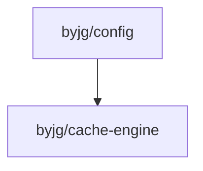

# Config: PSR-11 Container and Dependency Injection

[](https://github.com/byjg/php-config/actions/workflows/phpunit.yml)
[](http://opensource.byjg.com)
[](https://github.com/byjg/php-config/)
[](https://opensource.byjg.com/opensource/licensing.html)
[](https://github.com/byjg/php-config/releases/)
[](https://scrutinizer-ci.com/g/byjg/config/?branch=master)

This is a basic and minimalist implementation of PSR-11 for config management and dependency injection.

## Features

- **PSR-11 Compatible**: Implements PSR-11 Container Interface for standardized dependency injection
- **Auto-Initialization**: Automatically loads configuration from a bootstrap file with zero setup
- **Static Facade**: Clean, Laravel-style static API for accessing configuration anywhere
- **Environment-Based Configuration**: Easily switch between development, production, and custom environments
- **Multiple Configuration Formats**: Support for both PHP arrays and .env files
- **Dependency Injection**: Simple API for defining and resolving dependencies
- **Type Conversion**: Built-in parsers for converting configuration values to specific types
- **Caching Support**: Optional caching of configuration values for improved performance
- **Environment Inheritance**: Environments can inherit from one another to reduce configuration duplication
- **Abstract & Final Environments**: Design flexible environment hierarchies with constraints
- **Performance Optimizations**: Configure caching modes for different use cases

## Quick Start with Auto-Initialization

The fastest way to get started is using the auto-initialization feature:

```php
<?php
// 1. Create config/ConfigBootstrap.php
use ByJG\Config\ConfigInitializeInterface;
use ByJG\Config\Definition;
use ByJG\Config\Environment;

return new class implements ConfigInitializeInterface {
    public function loadDefinition(?string $env = null): Definition {
        $dev = new Environment('dev');
        $prod = new Environment('prod', [$dev]);

        return (new Definition())
            ->addEnvironment($dev)
            ->addEnvironment($prod);
    }
};
```

```php
<?php
// 2. Create your config file (config/config-dev.php)
return [
    'database' => [
        'host' => 'localhost',
        'port' => 3306
    ],
    'app_name' => 'My Application',
    'debug' => true
];
```

```php
<?php
// 3. Use Config anywhere in your app - no initialization needed!
use ByJG\Config\Config;

$appName = Config::get('app_name'); // "My Application"
$dbHost = Config::get('database')['host']; // "localhost"
```

## Traditional Example

You can also use the traditional approach without auto-initialization:

```php
<?php
// 1. Create a config file (config/config-dev.php)
return [
    'database' => [
        'host' => 'localhost',
        'port' => 3306
    ],
    'app_name' => 'My Application',
    'debug' => true
];

// 2. Set up and load the configuration
use ByJG\Config\Definition;
use ByJG\Config\Environment;

// Define the environments
$dev = new Environment('dev');
$prod = new Environment('prod', [$dev]); // prod inherits from dev

// Create and build the definition
$definition = (new Definition())
    ->addEnvironment($dev)
    ->addEnvironment($prod);

// Build with the current environment (using APP_ENV environment variable)
$container = $definition->build();

// 3. Use the configuration values
$appName = $container->get('app_name'); // "My Application"
$dbHost = $container->get('database')['host']; // "localhost"
```

### Dependency Injection Example

```php
<?php
// 1. Define your classes
namespace MyApp;

class DatabaseService 
{
    private $host;
    private $port;
    
    public function __construct($host, $port) 
    {
        $this->host = $host;
        $this->port = $port;
    }
}

class UserRepository 
{
    private $db;
    
    public function __construct(DatabaseService $db) 
    {
        $this->db = $db;
    }
}

// 2. Register them in your config file
use ByJG\Config\DependencyInjection as DI;
use ByJG\Config\Param;

return [
    'database' => [
        'host' => 'localhost',
        'port' => 3306
    ],
    
    // Register the database service
    \MyApp\DatabaseService::class => DI::bind(\MyApp\DatabaseService::class)
        ->withConstructorArgs([
            Param::get('database')['host'],
            Param::get('database')['port']
        ])
        ->toSingleton(),
    
    // Register the repository with auto-injection
    \MyApp\UserRepository::class => DI::bind(\MyApp\UserRepository::class)
        ->withInjectedConstructor()
        ->toInstance()
];

// 3. Use the services from the container
$userRepo = $container->get(\MyApp\UserRepository::class);
```

## How to Use This Component

Follow the steps below:

- [Auto-Initialization](docs/auto-initialization.md) - Automatically initialize Config with a bootstrap file (recommended);
- [Using the Config Facade](docs/config-facade.md) - Learn about the static Config facade;
- [Set up the configuration files](docs/setup.md);
- [Load the configuration](docs/load-the-configuration.md);
- [Optionally define the dependency injection](docs/dependency-injection.md);
- [Learn about special types](docs/special-types.md);
- [Configure your webserver](docs/configure-webserver.md);
- [Follow good practices](docs/good-practices.md);
- [Explore advanced features](docs/advanced-features.md);

## Installation

```bash
composer require "byjg/config"
```

## Tests

```bash
./vendor/bin/phpunit
```

## Dependencies


----
[Open source ByJG](http://opensource.byjg.com)